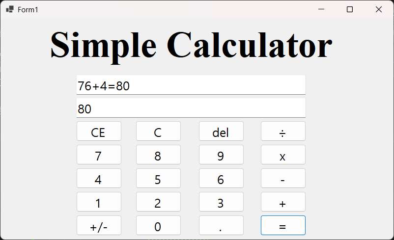
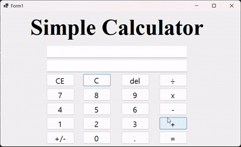

# (C# 코딩) 나만의 계산기

## 개요
- C# 프로그래밍 학습
- 1줄 소개: 사칙연산을 수행하는 계산기 프로그램
- 사용한 플랫폼:
  - C#, .NET Windows Forms, Visual Studio, GitHub
- 사용한 컨트롤:
  - Label, TextBox, Button
- 사용한 기술과 구현한 기능:
  - TextBox, Button을 적절히 배치하여 계산기의 기본 UI를 구성
  - 숫자 Button 클릭 시 TextBox에 입력된 숫자가 표시되는 기능 구현
  - 2개의 피연산자의 입력값을 Int로 바꾸어 더하기 계산을 수행하고 그 결과를 저장
  - 계산 결과 값을 문자열로 변환하여 TextBox에 표시하는 기능 구현

## 실행 화면 (과제1)
- 과제1 코드의 실행 스크린샷

- 과제 내용
  - 기본 UI 배치 및 기능 구현
  - 컨트롤 배치와 기본 적인 속성 설정
  - 입력 내용을 2가지 방법으로 표시하는 기능 구현
  - 계산기의 더하기 기능 구현

- 구현 내용과 기능 설명
  - TextBox, Button을 적절히 배치하여 계산기의 기본 UI를 구성
  - 숫자 Button 클릭 시 TextBox에 입력된 숫자가 표시되는 기능 구현
  - 2개의 피연산자의 입력값을 Int로 바꾸어 더하기 계산을 수행하고 그 결과를 저장
  - 계산 결과 값을 문자열로 변환하여 TextBox에 표시하는 기능 구현
	
## 실행 화면 (과제2)
- 과제2 코드의 실행 스크린샷

.png)
.png)
.png)

- 과제 내용
  - 사칙연산 기능 구현(빼기, 곱하기, 나누기)
  - 뺄셈, 곱셈, 나눗셈 이벤트 연결

- 구현 내용과 기능 설명
  - 뺄셈, 곱셈, 나눗셈 Button 클릭 시 TextBox에 입력된 숫자가 표시되는 기능 구현
  - 계산 결과가 나오는 기능 구현

## 실행 화면 (과제3)
- 과제3 코드의 실행 스크린샷

- 과제 내용
  - C, CE, Del 버튼 기능 추가 및 구현

- 구현 내용과 기능 설명
  - C 버튼 클릭 시 TextBox에 입력된 숫자가 모두 지워지는 기능 구현(ex. 12x34 -> )
  - CE 버튼 클릭 시 TextBox에 입력된 숫자 중 마지막 숫자가 전부 지워지는 기능 구현(ex. 12x34 -> 12x)
  - Del 버튼 클릭 시 TextBox에 입력된 숫자 중 마지막 숫자만 지워지는 기능 구현(ex. 12x34 -> 12x3)